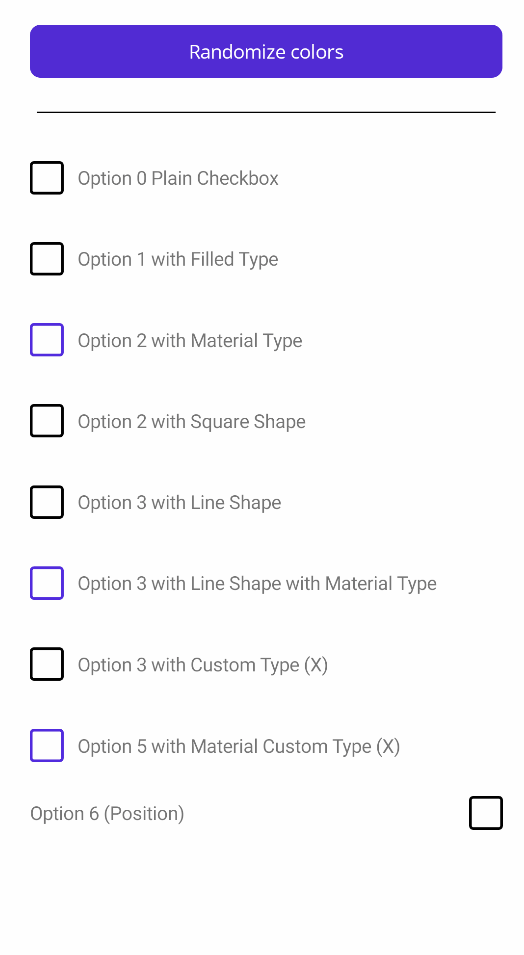

<table>
<tr>
	<td> </td>
	<td> 
		<h1> InputKit </h1>
		<p><a href="https://enisn-projects.io/docs/en/inputkit/latest/components/controls/CheckBox">CheckBox</a>, <a href="https://enisn-projects.io/docs/en/inputkit/latest/components/controls/RadioButton">RadioButton</a>, Advanced Entry, Advanced Slider etc.  </p> 
	</td>
</tr>
</table>


<hr />

[](https://ci.appveyor.com/project/enisn/xamarin-forms-inputkit)
[](https://www.codefactor.io/repository/github/enisn/xamarin.forms.inputkit)
[](https://www.nuget.org/packages/Xamarin.Forms.InputKit/)

<a href="https://enisn-projects.io/docs/en/inputkit/latest"> </a>
<br />
[](https://stars.medv.io/enisn/Xamarin.Forms.InputKit)
<hr/>


<hr/>

## Getting Started with InputKit on **MAUI**

- Install [InputKit.Maui](https://www.nuget.org/packages/InputKit.Maui) package from NuGet.

- Go to your **MauiProgram.cs** file and add following line:

    ```csharp
    builder
    .UseMauiApp<App>()
    .ConfigureMauiHandlers(handlers =>
    {
        // Add following line:
        handlers.AddInputKitHandlers(); // 👈
    })
                            
    ```

- Read the [documentation](https://enisn-projects.io/docs/en/inputkit/) for further information.

---

## Getting Started with InputKit on **Xamarin Forms**

- Install [Xamarin.Forms.InputKit](https://www.nuget.org/packages/Xamarin.Forms.InputKit) package from NuGet.

- Follow the [Documentation of Getting Started](https://enisn-projects.io/docs/en/inputkit/latest/getting-started/getting-started-xamarin) for each platform.

<hr />


## CheckBox

A checkbox control that is useful, customizable, full-featured, fully-bindable and easy to use.

- [Sample Code](sandbox/SandboxMAUI/Pages/CheckBoxPage.xaml)
- [Documentation](https://enisn-projects.io/docs/en/inputkit/latest/components/controls/CheckBox)

<br />
<table>
<tr>
<td>

</td>

<td>

</td>
<td>

</td>
</tr>
</table>
<hr />


## RadioButton

A radio button control that is useful, customizable, full-featured, fully-bindable and easy to use.

- [Sample Code](sandbox/SandboxMAUI/Pages/RadioButtonPage.xaml)
- [Documentation](https://enisn-projects.io/docs/en/inputkit/latest/components/controls/RadioButton)

<table>
<tr>
<td>

</td>

<td>

</td>
<td>

</td>
</tr>
</table>
<hr />

## Advanced Entry
This entry has many features to develop your applications quickly. When this entry is completed, it finds the next entry in the Parent layout and focuses it. AdvancedEntry contains a validation system inside it. You can set some properties to validate it and you can handle whether all your entries are validated or not with **FormView**.
You can set validation message and AnnotatinColor. Entry will automatically display your message when it's not validated.

- [Sample Code](sandbox/SandboxMAUI/Pages/AdvancedEntryPage.xaml)
- [Documentation](https://enisn-projects.io/docs/en/inputkit/latest/components/controls/AdvancedEntry)

<a href="#"></a>

<h4>PROPERTIES:</h4>
<ul>
<li><strong>Text:</strong> <em>(string)</em> Text of user typed</li>
<li><strong>Title:</strong> <em>(string)</em> Title will be shown top of this control</li>
<li><strong>IconImage:</strong> <em>(string)</em> Icons of this Entry. Icon will be shown left of this control</li>
<li><strong>IconColor:</strong> <em>(Color)</em> Color of Icon Image. IconImage must be a PNG and have Alpha channels. This fills all not-Alpha channels one color. <i>Default is Accent</i></li>
<li><strong>Placeholder:</strong> <em>(string)</em> Entry's placeholder.</li>
<li><strong>MaxLength:</strong> <em>(int)</em> Text's Maximum length can user type.</li>
<li><strong>MinLength:</strong> <em>(int)</em> Text's Minimum length to be validated.</li>
<li><strong>AnnotationMessage:</strong> <em>(string)</em> This will be shown below title. This automaticly updating. If you set this manually you must set true IgnoreValidationMessage !!!  .</li>
<li><strong>AnnotationColor:</strong> <em>(Color)</em> AnnotationMessage's color..</li>
<li><strong>Annotation:</strong> <em>(Enum)</em> There is some annotation types inside in kit.</li>
<li><strong>IsDisabled:</strong> <em>(bool)</em> Sets this control disabled or not.</li>
<li><strong>IsAnnotated:</strong> <em>(bool)</em> Gets this control annotated or not. Depends on Annotation</li>
<li><strong>IsRequired:</strong> <em>(bool)</em> IValidation implementation. Same with IsAnnotated</li>
<li><strong>ValidationMessage:</strong> <em>(string)</em> This is message automaticly displayed when this is not validated. **Use this one instead of annotationmessage**</li>
<li><strong>IgnoreValidationMessage:</strong> <em>(bool)</em> Ignores automaticly shown ValidationMessage and you can use AnnotationMessage as custom. </li>
<li><strong>CompletedCommand:</strong> <em>(ICommand)</em> Executed when completed. </li>
</ul>
<hr />


## SelectionView
Presents options to user to choose. This view didn't created to static usage. You should Bind a model List as ItemSource, or if you don't use MVVM you can set in page's cs file like below. (You can override ToString method to fix display value or I'll add displayMember property soon.)</p>

- [Sample Code](sandbox/SandboxMAUI/Pages/AdvancedEntryPage.xaml)
- [Documentation](https://enisn-projects.io/docs/en/inputkit/latest/components/controls/SelectionView)

<h4>SAMPLE:</h4>

```xaml
<?xml version="1.0" encoding="utf-8" ?>
<ContentPage xmlns="http://xamarin.com/schemas/2014/forms"
             xmlns:x="http://schemas.microsoft.com/winfx/2009/xaml"
             xmlns:local="clr-namespace:Sample.InputKit"
             xmlns:input="clr-namespace:Plugin.InputKit.Shared.Controls;assembly=Plugin.InputKit"
             x:Class="Sample.InputKit.MainPage">

    <StackLayout Spacing="12" Padding="10,0" VerticalOptions="CenterAndExpand">

        <input:SelectionView x:Name="selectionView" />

    </StackLayout>
</ContentPage>
```

```csharp
public partial class MainPage : ContentPage
	{
		public MainPage()
		{
			InitializeComponent();
            selectionView.ItemSource = new[]
            {
                "Option 1","Option 2","Option 3","Option 4","Option 5","Option 6","Option 7","Option 8"
            };
		}
	}
```

<a href="https://media.giphy.com/media/KXtC6oNnOgnJhvYecy/giphy.gif"></a>


You may use a object list as ItemSource, You can make this. Don't forget override **ToString()** method in your object.

sample object:

```csharp
  public class SampleClass
    {
        public int Id { get; set; }
        public string Name { get; set; }
        public override string ToString() => Name;
    }
```

Usage:

```csharp
public partial class MainPage : ContentPage
	{
		public MainPage()
		{
			InitializeComponent();
           selectionView.ItemSource = new[]
            {
                new SampleClass{ Name = "Option 1", Id = 1 },
                new SampleClass{ Name = "Option 2", Id = 2 },
                new SampleClass{ Name = "Option 3", Id = 3 },
                new SampleClass{ Name = "Option 4", Id = 4 },
                new SampleClass{ Name = "Option 5", Id = 5 },
                new SampleClass{ Name = "Option 6", Id = 6 },
                new SampleClass{ Name = "Option 7", Id = 7 },
                new SampleClass{ Name = "Option 8", Id = 8 },
            };
		}
	}
```


<h4>PROPERTIES:</h4>
<ul>
<li><strong>ItemSource:</strong> <em>(IList)</em> List of options</li>
<li><strong>SelectedItem:</strong> <em>(object)</em> Selected Item from ItemSource</li>
<li><strong>ColumnNumber:</strong> <em>(int)</em> Number of columng of this view</li>
</ul>

<hr />


## AutoCompleteEntry
Alternative picker with dropdown menu. _( Xamarin Forms only )_

```xaml
 <input:AutoCompleteEntry Title="Type something below:"
                          ItemsSource="{Binding MyList}" 
                          SelectedItem="{Binding SelectedItem}" />
```

<table>
<tr>
<td>
<a href="#"></a>
</td>
<td>
<a href="#"></a>
</td>
</tr>
</table>

<h4>PROPERTIES:</h4>
<ul>
<li><strong>Placeholder:</strong> <em>(string)</em> Placehodler Text</li>
<li><strong>Title:</strong> <em>(string)</em> Title will be shown top of this control</li>
<li><strong>IconImage:</strong> <em>(string)</em> Icons of this Entry. Icon will be shown left of this control</li>
<li><strong>Color:</strong> <em>(Color)</em> Color of Icon Image. IconImage must be a PNG and have Alpha channels. This fills all not-Alpha channels one color. <i>Default is Accent</i></li>
<li><strong>ValidationMessage:</strong> <em>(string)</em> This is message automaticly displayed when this is not validated. **Use this one instead of annotationmessage**</li>
<li><strong>AnnotationColor:</strong> <em>(Color)</em> AnnotationMessage's color..</li>
<li><strong>IsRequired:</strong> <em>(bool)</em> IValidation implementation. Same with IsAnnotated</li>
<li><strong>ItemsSource:</strong> <em>(IList)</em> Suggestions items</li>
</ul>

To be added...
<hr />

<h2>Dropdown ( Experimental )</h2>
<p>Alternative picker with dropdown menu. _(Xamarin Forms only)_
</p>
<h4>SAMPLE:</h4>

```xaml
 <input:Dropdown Title="Chosse an option below:"
                            TitleColor="Black"
                            ValidationMessage="This field is required" 
                            AnnotationColor="Accent" 
                            IsRequired="True" 
                            BorderColor="Black" 
                            Color="BlueViolet"
                            Placeholder="Choose one" 
                            ItemsSource="{Binding MyList}" 
                            SelectedItem="{Binding SelectedItem}" />
```
<a href="#"></a>

<h4>PROPERTIES:</h4>
<ul>
<li><strong>Placeholder:</strong> <em>(string)</em> Placehodler Text</li>
<li><strong>Title:</strong> <em>(string)</em> Title will be shown top of this control</li>
<li><strong>IconImage:</strong> <em>(string)</em> Icons of this Entry. Icon will be shown left of this control</li>
<li><strong>Color:</strong> <em>(Color)</em> Color of Icon Image. IconImage must be a PNG and have Alpha channels. This fills all not-Alpha channels one color. <i>Default is Accent</i></li>
<li><strong>ValidationMessage:</strong> <em>(string)</em> This is message automaticly displayed when this is not validated. **Use this one instead of annotationmessage**</li>
<li><strong>AnnotationColor:</strong> <em>(Color)</em> AnnotationMessage's color..</li>
<li><strong>IsRequired:</strong> <em>(bool)</em> IValidation implementation. Same with IsAnnotated</li>
</ul>

<hr />


<h2>Advanced Slider</h2>
<p>Xamarin Forms Slider works a Sticky label on it. Wonderful experience for your users.</p>
<h4>SAMPLE:</h4>

```xaml
<?xml version="1.0" encoding="utf-8" ?>
<ContentPage xmlns="http://xamarin.com/schemas/2014/forms"
             xmlns:x="http://schemas.microsoft.com/winfx/2009/xaml"
             xmlns:local="clr-namespace:Sample.InputKit"
             xmlns:input="clr-namespace:Plugin.InputKit.Shared.Controls;assembly=Plugin.InputKit"
             x:Class="Sample.InputKit.MainPage">

    <StackLayout Spacing="12" Padding="10,0" VerticalOptions="CenterAndExpand">

        <input:AdvancedSlider MaxValue="5000" MinValue="50" StepValue="50" ValuePrefix="Price:" ValueSuffix="€" Title="Choose Budget:"/>

    </StackLayout>

</ContentPage>
```
<a href="https://media.giphy.com/media/BoIPfRefA0Q9AtJ6mQ/giphy.gif"></a>

<h4>PROPERTIES:</h4>
<ul>
<li><strong>Value:</strong> <em>(double)</em> Current Selected Value, (this can be used TwoWayBinding)</li>
<li><strong>Title:</strong> <em>(string)</em> Title of slider</li>
<li><strong>ValueSuffix:</strong> <em>(string)</em> Suffix to be displayed near Value on Floating Label</li>
<li><strong>ValuePrefix:</strong> <em>(string)</em> Prefix to be displayed near Value on Floating Label</li>
<li><strong>MinValue:</strong> <em>(double)</em> Sliders' minimum value</li>
<li><strong>MaxValue:</strong> <em>(double)</em> Sliders' maximum value</li>
<li><strong>MaxValue:</strong> <em>(double)</em> Sliders' increment value</li>
<li><strong>TextColor:</strong> <em>(Color)</em> Color of Texts</li>
<li><strong>DisplayMinMaxValue:</strong> <em>(bool)</em> Visibility of Minimum and Maximum value</li>
</ul>
<hr />

# Did you like ?

<a href="https://www.buymeacoffee.com/enisn" target="_blank"></a>

Your coffee keeps me awake while developing projects like this. 👍☕

<hr />

