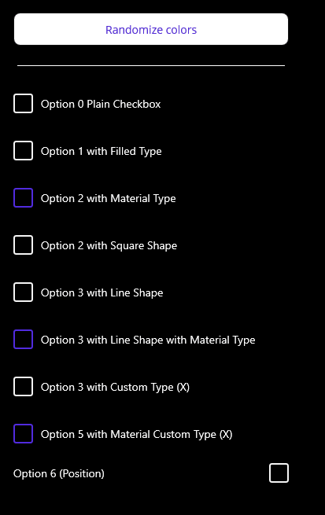
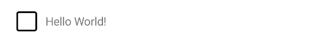
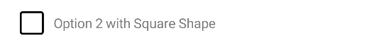
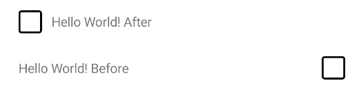

# InputKit: CheckBox

A checkbox control that is useful, customizable, full-featured, fully-bindable and easy to use.

## Supported Platforms

| - | MAUI | Xamarin Forms |
| :--- | :---: | :---: |
| Windows | ✅ | v4.0+ |
| macOS | ✅ | ✅ |
| Linux | ❌ | ❌ |
| Android | ✅ | ✅ |
| iOS | ✅ | ✅ |


## Showcase

```xml
 <input:CheckBox Text="Option 0 Plain Checkbox" />
 <input:CheckBox Text="Option 1 with Filled Type" Type="Filled" />
 <input:CheckBox Text="Option 2 with Material Type" Type="Material" />
 <input:CheckBox Text="Option 2 with Square Shape" IconGeometry="{x:Static input:PredefinedShapes.Square}" />
 <input:CheckBox Text="Option 3 with Line Shape" IconGeometry="{x:Static input:PredefinedShapes.Line}" />
 <input:CheckBox Text="Option 3 with Line Shape with Material Type" Type="Material" IconGeometry="{x:Static input:PredefinedShapes.Line}" />
 <input:CheckBox Text="Option 3 with Custom Type (X)" Type="Custom" IconGeometry="M17.705 7.705l-1.41-1.41L12 10.59 7.705 6.295l-1.41 1.41L10.59 12l-4.295 4.295 1.41 1.41L12 13.41l4.295 4.295 1.41-1.41L13.41 12l4.295-4.295z"/>
 <input:CheckBox Text="Option 5 with Material Custom Type (X)" Type="Material" IconGeometry="M17.705 7.705l-1.41-1.41L12 10.59 7.705 6.295l-1.41 1.41L10.59 12l-4.295 4.295 1.41 1.41L12 13.41l4.295 4.295 1.41-1.41L13.41 12l4.295-4.295z"/>
 <input:CheckBox Text="Option 6 (Position)" Type="Regular" LabelPosition="Before"/>
```

> _You can visit entire code from [here](../../sandbox/SandboxMAUI/Pages/CheckBoxPage.xaml)_

| Dark - Desktop | Light - Mobile |
| --- | --- |
|  |  |


## Usage

Before starting to use. Make sure you're not using MAUI/Xamarin Forms checkbox in your pages.

Make sure you defined InputKit namespace in your XAML file.

| | |
| --- | --- |
| MAUI | `xmlns:input="clr-namespace:InputKit.Shared.Controls;assembly=InputKit.Maui"` |
| Xamarin Forms | `xmlns:input="clr-namespace:Plugin.InputKit.Shared.Controls;assembly=Plugin.InputKit"` |


Now you're ready to use it in your XAML page.

```xml
<input:CheckBox Text="Hello World">
```


## Customization

CheckBox allows you to customize its appearance in different ways.

### Type
CheckBox supports three types of appearance:
    - Regular - default type, looks like a checkbox.
    - Filled - looks like filled when selected with Border Color of the control.
    - Material - looks like filled when selected with `Color` property color.

#### Regular Type
This is default value. If you don't specify any type, it will be regular type.

```xml
<input:CheckBox Text="Hello World!" />
<!-- Or you can specify the Type like below -->
<input:CheckBox Text="Hello World!" Type="Regular" />
```


#### Filled Type
This type is used when you want to fill the control with Border Color of the control when it's selected.

```xml
<input:CheckBox Text="Hello World!" Type="Filled" />
```



#### Material Type
This type is used when you want to fill the control with `Color` property color when it's selected.


```xml
<input:CheckBox Text="Hello World!" Type="Material" />
```


### Icons

CheckBox icon can be customized in two different ways. You can use predefined shapes or you can use custom shape.
InputKit provides a collection of predefined shapes that can be used as an icon.

> Check all [Predefined Shapes](../../sandbox/SandboxMAUI/Pages/CheckBoxPage.xaml)

- Predefined shapes can be used as parameter of `IconGeometry` property.

```xml
<input:CheckBox Text="Option 2 with Square Shape" IconGeometry="{x:Static input:PredefinedShapes.Square}" />
```




- Custom shape can be used as parameter of `IconGeometry` property. A plain SVG path can be used as an icon.

```xml
<input:CheckBox 
    Text="Option 5 with Material Custom Type (X)" 
    Type="Material" 
    IconGeometry="M17.705 7.705l-1.41-1.41L12 10.59 7.705 6.295l-1.41 1.41L10.59 12l-4.295 4.295 1.41 1.41L12 13.41l4.295 4.295 1.41-1.41L13.41 12l4.295-4.295z"/>
```


### Label Position

CheckBox supports two label positions:
    - Before - label is positioned before the control.
    - After - label is positioned after the control. (default)

```xml
<input:CheckBox Text="Hello World! After" LabelPosition="After" />
<input:CheckBox Text="Hello World! Before" LabelPosition="Before" />
```



### Colors

You can customize checkbox colors by setting `Color`, `BackgroundColor`, `BorderColor`, `BoxBackgroundColor`, `TextColor` and `IconColor` properties.

```xml
    <input:CheckBox 
        Text="Hello World!"
        Color="Blue"
        BorderColor="LightBlue"
        IconColor="DarkBlue"
        BoxBackgroundColor="LightGray"
        TextColor="Blue"
        BackgroundColor="AliceBlue"
        />
```


Color property will be applied when you set `Type` to `Material`.

```xml
<input:CheckBox 
    Text="Hello World!"
    Type="Material"
    Color="Blue"
    BorderColor="LightBlue"
    IconColor="DarkBlue"
    BoxBackgroundColor="LightGray"
    TextColor="Blue"
    BackgroundColor="AliceBlue"
    />
```


