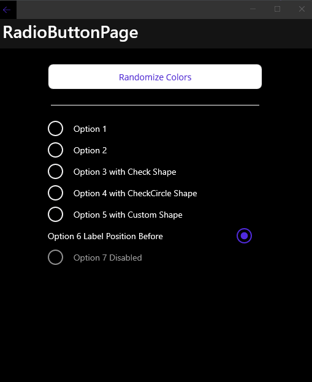
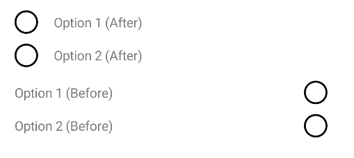

# InputKit: RadioButton

A radio button control that is useful, customizable, full-featured, fully-bindable and easy to use.

| Dark - Desktop | Light - Mobile |
| --- | --- |
|  |  |

> _You can visit entire code of this sample from [here](https://github.com/enisn/Xamarin.Forms.InputKit/tree/develop/sandbox/SandboxMAUI/Pages/RadioButtonPage.xaml)_

## Supported Platforms

| - | MAUI | Xamarin Forms |
| :--- | :---: | :---: |
| Windows | ✅ | v4.0+ |
| macOS | ✅ | ✅ |
| Linux | ❌ | ❌ |
| Android | ✅ | ✅ |
| iOS | ✅ | ✅ |

 ## Usage

 Make sure you defined InputKit namespace in your XAML file.

 | | |
| --- | --- |
| MAUI | `xmlns:input="clr-namespace:InputKit.Shared.Controls;assembly=InputKit.Maui"` |
| Xamarin Forms | `xmlns:input="clr-namespace:Plugin.InputKit.Shared.Controls;assembly=Plugin.InputKit"` |


Now you're ready to use it in your XAML page. RadioButtons should be grouped together in a RadioButtonGroupView. Otherwise, they will not work properly and each one will be independent.


```xml
<input:RadioButtonGroupView>
    <input:RadioButton Text="Option 1" />
    <input:RadioButton Text="Option 2" />
</input:RadioButtonGroupView>
```


### Data Binding

All of the RadioButton properties are bindable.

- `IsChecked` property can be used separately from the RadioButtonGroupView.
```xml
 <input:RadioButton Text="Option 1" IsChecked="{Binding IsOption1}" />
```

- RadioButtonGroupView provides `SelectedIndex` and `SelectedItem` properties. _You can use one of them to handle or change selected item._
    ```xml
    <input:RadioButtonGroupView SelectedIndex="{Binding SelectedIndex}" SelectedItem="{Binding SelectedItem}">
        <input:RadioButton Text="Option 1" Value="1" />
        <input:RadioButton Text="Option 2" Value="2" />
    </input:RadioButtonGroupView>
    ```
    - `SelectedIndex`: Gets or sets selected item by index.
    - `SelectedItem`: Gets or sets selected item by value. You should add `Value` to each RadioButton. 

- RadioButtonGroupView provides `SelectedItemChangedCommand` and `SelectedItemChangedCommandParameter` properties. _You can use one of them to handle or change selected item._
    ```xml
    <input:RadioButtonGroupView SelectedItemChangedCommand="{Binding SelectedItemChangedCommand}" SelectedItemChangedCommandParameter="{Binding SelectedItemChangedCommandParameter}">
        <input:RadioButton Text="Option 1" Value="1" />
        <input:RadioButton Text="Option 2" Value="2" />
    </input:RadioButtonGroupView>
    ```

    - `SelectedItemChangedCommand`: Gets or sets command to execute when selected item is changed.
    - `SelectedItemChangedCommandParameter`: Gets or sets parameter to pass to command when selected item is changed. _(By default it's selected item value.)_


> If you're looking for dynamic RadioButton list and want to get only selected item/items after selection. Check the [SelectionView](SelectionView.md)

## Customization

### Icons

RadioButton icon can be customized in two different ways. You can use predefined shapes or you can use custom shape.
InputKit provides a collection of predefined shapes that can be used as an icon.

> Check all [Predefined Shapes](../../PredefinedShapes.md) for more info.

- Predefined shapes can be used as parameter for `SelectedIconGeomerty` property.

```xml
<input:RadioButton Text="Option 1" SelectedIconGeomerty="{x:Static input:PredefinedShapes.CheckCircle}" />
```


- Custom shape can be used as parameter of `SelectedIconGeomerty` property. A plain SVG path can be used as an icon.

```xml
<input:RadioButton 
    Text="Option 5 with Custom Shape" 
    SelectedIconGeomerty="M 15.6038 7.1366 v 5.8061 c 0 0.8669 -0.8266 1.6934 -1.6934 1.6934 h -5.0803 c -1.0547 0 -1.9094 -0.1302 -2.903 -0.4838 c -0.3068 -0.1092 -1.2096 -0.4838 -1.2096 -0.4838 V 6.8947 l 3.9939 -4.6913 L 9.072 0.121 h 0.7258 c 0.804 0 1.3703 0.6415 1.3703 1.4456 v 0.4522 c 0 1.0321 -0.0622 2.0633 -0.1862 3.0879 L 10.9412 5.4432 H 13.9104 C 14.7773 5.4432 15.6038 6.2698 15.6038 7.1366 z M 0.121 14.3942 h 3.6288 V 6.169 H 0.121 V 14.3942 z"/>
```


### Colors

You can customize RadioButton colors by setting `Color`, `CircleColor` and `TextColor`.

```xml
<input:RadioButton Text="Option 1" Color="Red" CircleColor="Orange" TextColor="Purple" />
```


### Label Position

RadioButton supports two label positions:
- Before - label is positioned before the control.
- After - label is positioned after the control. (default)

```xml
<input:RadioButtonGroupView>
    <input:RadioButton Text="Option 1 (After)" LabelPosition="After"/>
    <input:RadioButton Text="Option 2 (After)" LabelPosition="After"/>
</input:RadioButtonGroupView>


<input:RadioButtonGroupView>
    <input:RadioButton Text="Option 1 (Before)" LabelPosition="Before"/>
    <input:RadioButton Text="Option 2 (Before)" LabelPosition="Before"/>
</input:RadioButtonGroupView>
```




## Custom Content
You can use your custom content as RadioButton content. You can use any `View` as content of CheckBox.

```xml
<input:RadioButtonGroupView x:Name="groupView">
    <input:RadioButton>
        <Image Source="https://seeklogo.com/images/X/xamarin-logo-F85620A85D-seeklogo.com.png" WidthRequest="50" HeightRequest="50" />
    </input:RadioButton>

    <input:RadioButton>
        <Image Source="dotnet_bot.png" WidthRequest="50" HeightRequest="50" />
    </input:RadioButton>
</input:RadioButtonGroupView>
```


## Visual States
RadioButton has 5 different visual states:
- `Normal` : Default state.
- `Selected` : When `IsChecked` is `true`.
- `Disabled` : When `IsEnabled` is `false`.
- `PointerOver` : When pointer is over the control. _(Desktop devices)_
- `Pressed` : When control is pressed.

You can define your styles on top of these states.

```xml
<Style TargetType="input:RadioButton" ApplyToDerivedTypes="True">
    <Setter Property="VisualStateManager.VisualStateGroups">
        <VisualStateGroupList>
            <VisualStateGroup x:Name="CommonStates">
                <VisualState x:Name="Normal">
                    <VisualState.Setters>
                        <Setter Property="Color" Value="Red" />
                        <Setter Property="TextColor" Value="Black" />
                    </VisualState.Setters>
                </VisualState>
                <VisualState x:Name="Selected">
                    <VisualState.Setters>
                        <Setter Property="TextColor" Value="Red" />
                    </VisualState.Setters>
                </VisualState>
            </VisualStateGroup>
        </VisualStateGroupList>
    </Setter>
</Style>
```

## Behaviors

** *Work in progess...* **:
-  _Actions to override_ 
-  _Make your own animation (?)_