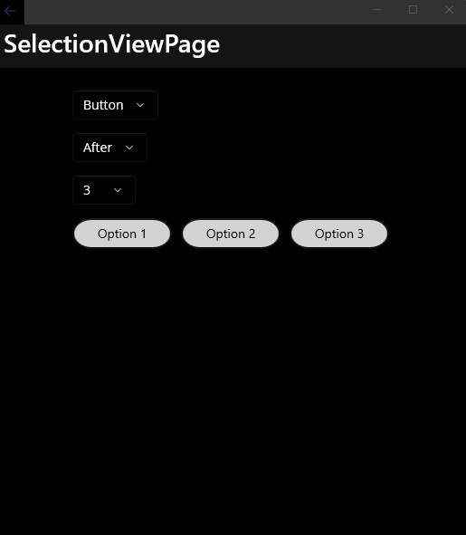
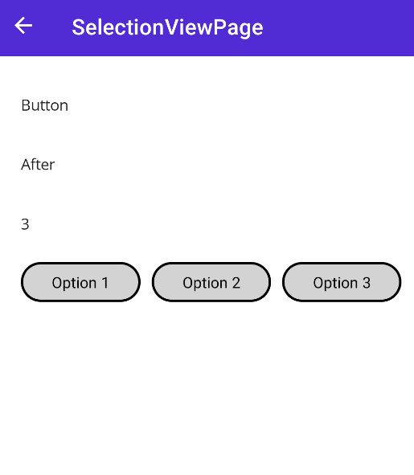
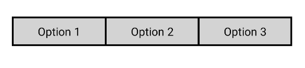

# SelectionView
SelectionView is a dynamic control. It needs a **ItemsSource** to generate views.
It can handle single selections and multi selections.


| Dark - Desktop | Light - Mobile |
| --- | --- |
|  |  |

<hr />

## Supported Platforms

SelectionView isn't a platform specific control. It generates other controls dynamically. Please check control's supported platform that you're using with SelectionView.

## Usage
Make sure you defined InputKit namespace in your XAML file.

 | | |
| --- | --- |
| MAUI | `xmlns:input="clr-namespace:InputKit.Shared.Controls;assembly=InputKit.Maui"` |
| Xamarin Forms | `xmlns:input="clr-namespace:Plugin.InputKit.Shared.Controls;assembly=Plugin.InputKit"` |

SelectionView is designed to used with dynamic list of items. But still you can create a static list of items in XAML.

### Basic Usage
- Basic usage is:

```xml
 <input:SelectionView>
     <input:SelectionView.ItemsSource>
         <x:Array Type="{x:Type x:String}">
             <x:String>Option 1</x:String>
             <x:String>Option 2</x:String>
             <x:String>Option 3</x:String>
         </x:Array>
     </input:SelectionView.ItemsSource>
 </input:SelectionView>
```

### Regular Usage
- In regular usage, you have to define items in a viewmodel.

    ```csharp
    public class MainViewModel
    {
        public ObservableCollection<string> Items { get; set; }
    }
    ```

    ```xml
    <input:SelectionView ItemsSource="{Binding Items}" />
    ```

- Also, ComplexType items are supported too.

    ```csharp
    public class MainViewModel
    {
        public ObservableCollection<Item> Items { get; set; }

        public class Item
        {
            public string Name { get; set; }
            public string Description { get; set; }
        }
    }
    ```

    ```xml
    <input:SelectionView 
        ItemsSource="{Binding Items}"
        ItemDisplayBinding="{Binding Name}"/>
    ```

> **Tip:** `ItemDisplayBinding` is not the only way to display item's name. You can override `ToString()` method of your item class to display custom name.
> ```csharp	
> public override string ToString()
> {
>   return Name;
> }


### Data Binding
SelectionView Supports single and multi selections. Selections are defined in `SelectionType` property. Some of selection types supports multiple selection and some them supports single selection. Default SelectionType is Button. Following selection types are supported:
- `Button` : (Default) Regular button selection. Only one item can be selected at a time.
- `RadioButton` : Radio button selection. Only one item can be selected at a time.
- `CheckBox` : Check box selection. Multiple items can be selected at a time.
- `MultipleButton` : Multiple button selection. Multiple items can be selected at a time.
- `SingleCheckbox` : Single checkbox selection. Only one item can be selected at a time.
- `MultipleRadioButton` : Multiple radio button selection. Multiple items can be selected at a time. _(But radiobuttons can't be unselected by their nature. This option isn't usuful much.)_

Single selections can be handled with `SelectedItem` or `SelectedIndex` property.
```csharp
    public class MainViewModel
    {
        public ObservableCollection<string> Items { get; set; }
        public string SelectedItem { get; set; }
    }
```

```xml
<input:SelectionView 
    SelectionType="RadioButton"
    ItemsSource="{Binding Items}" 
    SelectedItem="{Binding SelectedItem}" />
```

Multiple selections can be handled with `SelectedItems` or `SelectedIndexes` property.

```csharp
    public class MainViewModel
    {
        public ObservableCollection<string> Items { get; set; }
        public ObservableCollection<string> SelectedItems { get; set; }
    }
```

```xml
<input:SelectionView 
    SelectionType="CheckBox"
    ItemsSource="{Binding Items}" 
    SelectedItems="{Binding SelectedItems}" />
```

## Customizations
SelectionView is a control that can be customized in many ways.

### ColumnNumber
SelectionView can be divided into multiple columns. This property defines the number of columns. Default value is `2`.

*You can easily make a segmented control by setting this property to 3.*

```xml
<input:SelectionView 
    ColumnNumber="3"
    RowSpacing="0"
    ItemsSource="{Binding Items}" />
```




### IsDisabledPropertyName

SelectionView items can be disabled individually. This property defines the name of the property that is used to disable the control. Default value is `IsDisabled`.

    ```csharp
    public class MainViewModel
    {
        public ObservableCollection<Product> Items { get; set; }

        public class Product
        {
            public string Name { get; set; }
            public bool OutOfStock { get; set; }
            public override string ToString() => Name;
        }
    }
    ```

    ```xml
    <input:SelectionView
        IsDisabledPropertyName="OutOfStock"
        ItemsSource="{Binding Items}"
        ColumnNumber="1"/>
    ```


### DisabledSource

Items also can be disabled from a a list of disabled item list source. This property defines the source of the list of disabled items. Objects should be same reference.

Otherwise;
- Item class should implement IEquatable interface.
- Item class should override `Equals` method inside and make manual check.

```csharp
    public class MainViewModel
    {
        public ObservableCollection<Product> Items { get; set; }
        public ObservableCollection<Product> DisabledItems { get; set; }

        public class Product : IEquatable<Product>
        {
            public string Name { get; set; }

            // Objects will be compared with their Names,
            // even they're not the same reference in memory.
            public bool Equals(Product other) => Name == other.Name;
        }
    }
```

```xml
    <input:SelectionView
        ItemsSource="{Binding Items}"
        DisabledSource="{Binding DisabledItems}"
        ColumnNumber="1"/>
        
```

## Overriding SelectionView Item

You can implement your own control and use it in SelectionView instead of using built-in SelectionTypes.

Firstly, you should create a new control that implements `ISelection` interface.

```csharp
public class MySwitch : ImageButton, ISelection
{
    public MySwitch()
    {
        this.Source = "turned_off.png";
        this.Clicked += (s, e) =>
        {
            if (IsDisabled)
                return;

            IsSelected = !IsSelected;

            if (IsSelected)
            {
                this.Source = "turned_on.png";
            }
            else
            {
                this.Source = "turned_off.png";
            }
        };
    }

    public bool IsSelected { get; set; }
    public object Value { get; set; }
    public bool IsDisabled { get; set; }
}
```

Then you should override SelectionView's `CreateItem()` method to return your control.

```csharp
public class MySelectionView : SelectionView
{
    public override ISelection GetInstance(object obj)
    {
        return new MySwitch();
    }
}
```

Use your component in XAML page.

```xml
<custom:MySelectionView ItemsSource="{Binding Items}" />
```


