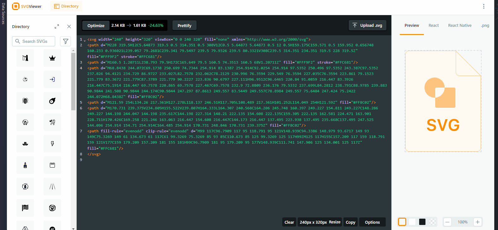

# Migrating to v4.0

InputKit version 4.0 is a major release. It has many new features and improvements. Some of them makes breaking-changes.

## What's new?
- InputKit is now supports Windows platform on both Xamarin Forms & InputKit. `UWP` is now supported on Xamarin Forms, and WinUI is now supported on MAUI.

- InputKit is now uses svg paths to render the icons and components itself.
  
- New animations.

- CheckBox & ReadioButton are completely redesigned. _(we tried keep the same visual)_.

## Breaking changes

- InputKit can't access the `Color.Accent` colors because it's not exist anymore. You can configure the Accent color that InputKit uses in **MauiProgram.cs** or **App.xaml.cs** file like below:

    ```csharp
    InputKitOptions.GetAccentColor = () => Color.FromArgb("#1CD6CE");
    ```

### CheckBox
CheckBox got a major update.

#### Colors
Outline colors are changed. You may need to check change the color of the control if necessary.
Now, outline colors can be Dark _(Black)_ or Light _(White)_ according to the app theme.
#### Font Sizes
- Font sizes are changed. It might be bigger or smaller according to the platform. You may need to check change the font size of the control if necessary.

#### Type
`Type` property is completely changed and it doesn't affect to the checkbox icon anymore. `Box`, `Check`, `Cross`,`Star` and `Custom` are now deprecated. You should take action if you're using some of them.

New `Type` property has `Regular`, `Filled` and `Material` values. 


- `Box`: This type is deprecated. You can use `Regular` type instead and set IconGeometry. 
    ```xml
    <!-- Old -->
    <input:CheckBox Type="Box" />

    <!-- New -->
    <input:CheckBox Type="Regular" IconGeometry="{x:Static input:PredefinedShapes.Square}" />
    ```
    - Also default icon is switchted to Check from Box. If you have CheckBoxes without Type attribute, you should set IconGeometry too.
    ```xml
    <!-- Old -->
    <input:CheckBox />
    <!-- New -->
    <input:Checkbox IconGeometry="{x:Static input:PredefinedShapes.Square}"/>
    ```


- `Check`: This type doesn't exist anymore. You can use `Regular` type instead and no need any more changes. Check icon is default now.

    ```xml
    <!-- Old -->
    <input:CheckBox Type="Check"/>
    <!-- New -->
    <input:Checkbox />
    ```

- `Cross`: This type doesn't exist anymore and isn't supported by InputKit. You should find a custom SVG shape to keep using this type. See [CheckBox Icons section](../components/controls/CheckBox.md#icons) for more info. 
    
    ```xml
    <!-- Old -->
    <input:CheckBox Type="Cross"/>
    <!-- New -->
    <input:CheckBox IconGeometry="M17.705 7.705l-1.41-1.41L12 10.59 7.705 6.295l-1.41 1.41L10.59 12l-4.295 4.295 1.41 1.41L12 13.41l4.295 4.295 1.41-1.41L13.41 12l4.295-4.295z"/>
    ```

- `Star`: This type doesn't exist anymore and isn't supported by InputKit. You should find a custom SVG shape to keep using this type. See [CheckBox Icons section](../components/controls/CheckBox.md#icons) for more info. 
- 
    ```xml
    <!-- Old -->
    <input:CheckBox Type="Cross"/>
    <!-- New -->
    <input:CheckBox IconGeometry="M 16.7472 9.704 L 14.256 12.0976 l 0.588 3.3768 a 1.4592 1.4592 90 0 1 -0.5808 1.4336 a 1.4976 1.4976 90 0 1 -1.5784 0.1216 L 9.6 15.432 l -3.0848 1.6 a 1.4952 1.4952 90 0 1 -1.5784 -0.1216 a 1.4592 1.4592 90 0 1 -0.5808 -1.4336 l 0.588 -3.3768 L 2.4528 9.704 a 1.456 1.456 90 0 1 -0.3816 -1.5048 A 1.476 1.476 90 0 1 3.28 7.1888 l 3.4472 -0.4936 l 1.5408 -3.076 a 1.4968 1.4968 90 0 1 2.6688 0 l 1.5408 3.076 l 3.4472 0.4936 a 1.476 1.476 90 0 1 1.2064 1.0104 A 1.456 1.456 90 0 1 16.7472 9.704 Z"/>
    ```

    > **Tip:** You can find a better icon from [here](https://www.svgviewer.dev/s/11948/star).

- `Custom`: This type doesn't exist and images aren't used anymore. IconView dependency will be removed in next major version. There is no good way to migrate your custom icons but you can search and find a custom SVG shape from here [here](https://www.svgviewer.dev/)

    

---

### RadioButton

#### Font Sizes
- Font sizes are changed. It might be bigger or smaller according to the platform. You may need to check change the font size of the control if necessary.

#### Colors
Outline colors are changed. You may need to check change the color of the control if necessary.
Now, outline colors can be Dark _(Black)_ or Light _(White)_ according to the app theme.

#### Icons

RadioButton also started to use svg icons. So if you are using custom icons, you should take action to migrate them.

`CircleImage`, `CheckedImage` properties are deprecated. 

- `CircleImage`: This property is completely removed. There is no way to change the circle shape yet. :(
- `CheckedImage`: This property is completely removed. `SelectedIconGeomerty` can be used instead.There is no good way to migrate your custom icons but you can search and find a custom SVG shape from here [here](https://www.svgviewer.dev/)
    

    > **Tip:** You can use [PreDefined Shapes](../PredefinedShapes.md) of InputKit. Visit [Icons section](../components/controls/RadioButton.md#icons) of the RadioButton documentation.


*TODO*

Check breaking changes in 4.0 milestone until this documentation is completed
https://github.com/enisn/Xamarin.Forms.InputKit/pulls?q=is%3Apr+is%3Aclosed+label%3Abreaking-change+milestone%3Av.4.0.0